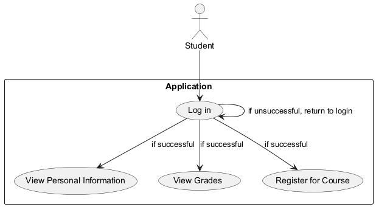
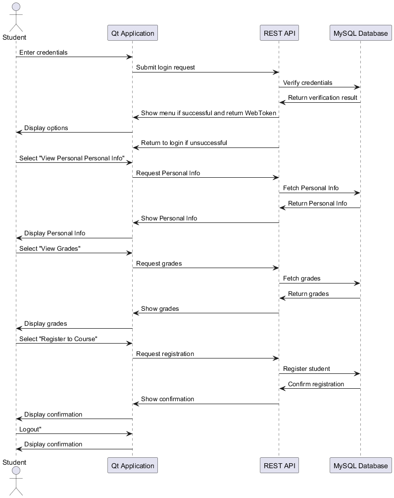
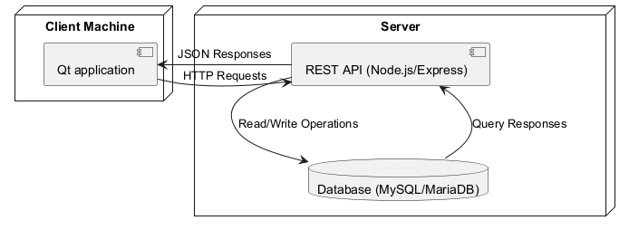
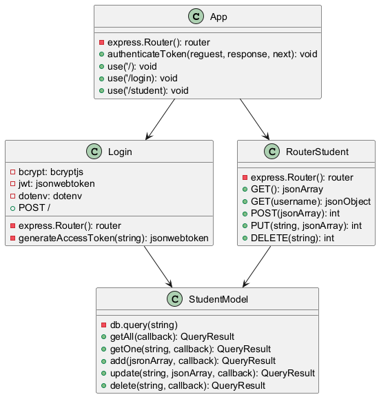
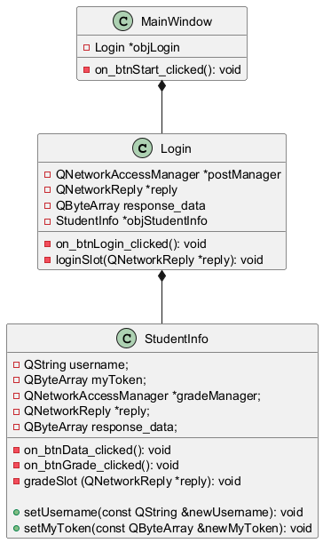
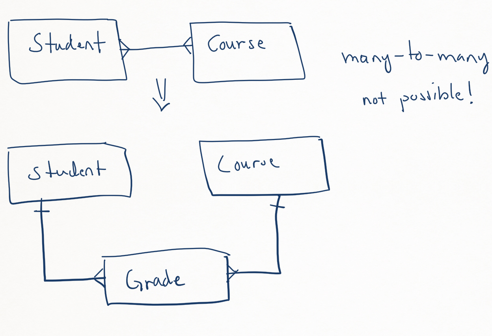
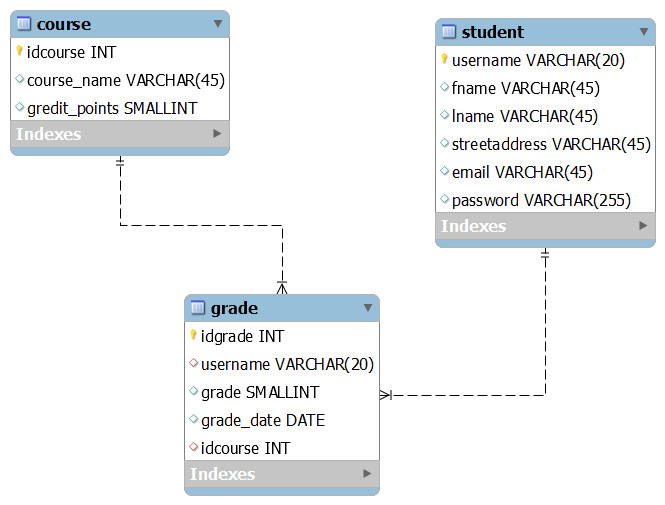

<h1>Peppi esimerkki</h1>

Tämän esimerkin on tarkoitus auttaa ohjelmistoprojektin pankkiautomaatin suunnittelussa ja toteutuksessa. Esimerkin aiheena on Peppi oppilasrekisteriä vastaavan ohjelmiston rakentaminen. Esimerkin sovellukseen on otettu vain pieni osuus Peppi järjestelemästä.

<h2>Järjestelmän toiminnan kuvaus</h2>

    Sovellukseen toteutetaan seuraavat toiminnot:
    <ul>
    <li>Voidakseen katsoa henkilötietonsa opiskelijan on kirjauduttava sovellukseen.</li>
    <li>Voidakseen katsoa arvosanansa opiskelijan on kirjauduttava sovellukseen.</li>
    <li>Voidakseen ilmoittautua kurssille opiskelijan on kirjauduttava sovellukseen.</li>
    <li>Jos kirjautuminen onnistuu opiskelijalle avautuu valikko, josta hän voi valita joko katso henkilötiedot tai katso arvosanat.</li>
    <li>Mikäli kirjautuminen ei onnistu, palataan kirjautumisruudulle.</li>
    </ul>

<h2>Käyttötapauskaavio</h2>

Edellisten tarinoiden perusteella luotiin seuraava käyttötapauskaavio 
 

<h2>Viestiyhteyskaavio</h2>

Seuraavaksi luotiin viestiyhteyskaavio
 

<h2>Käyttöönottokaavio</h2>

Seuraavaksi suunniteltiin ohjelmiston arkkitehtuuria. Päätettiin, että käytetään MySQL-tietokantaa, REST API tehdään käyttäen Node.js/Express.js alustaa ja käyttäjän sovellus tehtään C++ ohjelointikielellä käyttäen Qt-frameworkkiä. Tällä perusteella laadittiin käyttöönottokaavio
 

<h2>Komponenttikaavio</h2>

Seuraavaksi suunniteltiin ohjelmiston komponentit ja laadittiin komponenttikaavio
 

<h2>Luokkakaavio</h2>

Seuraavaksi suunniteltiin ohjelmiston luokat ja laadittiin luokkakaaviot

<b>REST API:n luokkakaavio</b>  
 

<b>Qt sovelluksen luokkakaavio</b>  
 

<h2>Tietokannan suunnittelu</h2>

Aluksi tietokannan ER-kaaviota hahmoteltiin kynällä ja paperilla ja saatiin seuraavat kuvat:
 

 
Kaaviota piirettiin siis niin pitkälle, että todettiin ettei monen-suhde-moneen yhteyksiä ole.

    Tämän jälkeen tietokannan taulut luotiin MySQL-Workbench sovelluksella. Tauluihin merkittiin kentät, perusavaimet ja luotiin viiteavaimien avulla viite-eheys. Tämän jälkeen Workbenchillä generoitiin tietokanta ja ER-kaavio. Nyt tietokanta ja sen ER-malli ovat varmasti yhtäpitävät.
 

 

<h2>Käyttöliittymän suunnittelu</h2>

Käyttöliittymää hahmoteltiin seuraavissa kuvissa. Tarkoitus olisi piirtää paremmat kuvat ennen toteutusta. 
 

   

