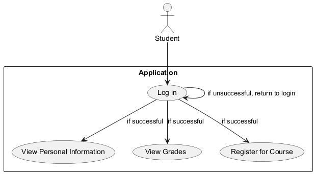
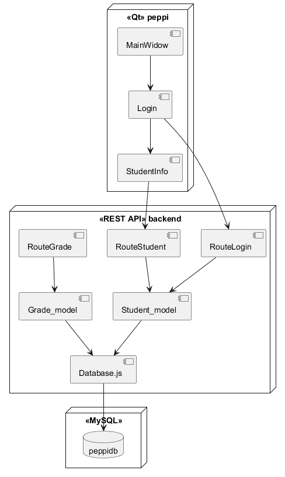

<h1>Peppi esimerkki</h1>

Tämän esimerkin on tarkoitus auttaa ohjelmistoprojektin pankkiautomaatin suunnittelussa ja toteutuksessa. Esimerkin aiheena on Peppi oppilasrekisteriä vastaavan ohjelmiston rakentaminen. Esimerkin sovellukseen on otettu vain pieni osuus Peppi järjestelemästä.

<h2>Järjestelmän toiminnan kuvaus</h2>

    Sovellukseen toteutetaan seuraavat toiminnot:
    <ul>
    <li>Voidakseen katsoa henkilötietonsa opiskelijan on kirjauduttava sovellukseen.</li>
    <li>Voidakseen katsoa arvosanansa opiskelijan on kirjauduttava sovellukseen.</li>
    <li>Voidakseen ilmoittautua kurssille opiskelijan on kirjauduttava sovellukseen.</li>
    <li>Jos kirjautuminen onnistuu opiskelijalle avautuu valikko, josta hän voi valita joko katso henkilötiedot tai katso arvosanat.</li>
    <li>Mikäli kirjautuminen ei onnistu, palataan kirjautumisruudulle.</li>
    </ul>

<h2>Käyttötapauskaavio</h2>

Edellisten tarinoiden perusteella luotiin seuraava käyttötapauskaavio 
 

Voit ladata sen sivulta <a href="https://plantuml.com/download" target="_blank">https://plantuml.com/download</a>. 

Riittää siis, että lataat tuon jar-tiedoston, mutta sovelluksen ajamiseksi tarvitset Javan.

Minulla on esimerkiksi tiedosto <b>myComponent.puml</b> ja voin generoida siitä png-kuvan komennolla

<pre>
java -jar plantuml-1.2025.0.jar myComponent.puml
</pre>

Repossa on on koodit 
<ul>
    <li>käyttöönottokaaviolle myBase.puml</li>
    <li>komponenttikaaviolle myComponent.puml</li>
    <li>käyttötapauskaaviolle myUseCase.puml</li>
    <li>Qt:n luokkakaaviolle myPeppiClass.puml</li>
    <li>REST API:n luokkakaaviolle myRestApiClass.puml</li>
</ul>

<h2>plantUML koodiopas</h2>

Opas löytyy sivulta <a href="https://plantuml.com/guide" target="_blank">https://plantuml.com/guide</a>

<h2>Esimerkkikoodien kuvat</h2>
    <h3>käyttöönottokaaviolle </h3> 
    <h3>komponenttikaaviolle </h3> 
    <h3>käyttötapauskaaviolle </h3> 
    <h3>Qt:n luokkakaaviolle </h3> 
    <h3>REST API:n luokkakaaviolle </h3> 